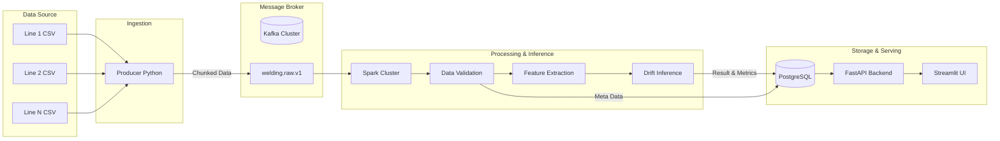

# Battery Welding Drift Detection - Kafka Collection Pipeline

## 1. 프로젝트 개요
배터리 레이저 용접 공정에서 발생하는 센서 데이터를 수집하고 처리하여 용접 품질의 이상(Drift)을 탐지하는 데이터 파이프라인 구축 프로젝트입니다.
실제 센서 API가 없는 환경을 가정하여, 각 생산 라인의 설비 PC/NAS에 제품별 센서 CSV 파일이 10초마다 생성된다고 봅니다. 이 파일들을 Python Producer가 읽어들여 Kafka로 발행(Publish)하고, 이후 Spark 중심의 파이프라인을 통해 데이터 검증, 전처리, 피처 추출, 모델 추론을 거쳐 PostgreSQL 데이터베이스에 최종 결과를 적재합니다.

## 2. 전체 아키텍처 설명

아래는 전체 파이프라인 아키텍처 다이어그램입니다. 
*(Excalidraw로 확인하려면 아래 Mermaid 코드를 복사하여 [Excalidraw 캔버스](https://excalidraw.com/)에 붙여넣기(`Ctrl+V`) 하거나 'Insert -> Mermaid'를 사용하세요.)*



## 3. 설치 및 실행 방법

### 3.1. 사전 준비
Python 패키지는 `uv`를 통해 관리합니다.
```bash
# 환경 설정 파일 복사
cp .env.example .env
```
`.env` 파일에 로컬 데이터 경로(`DATA_DIR`, `STORAGE_DIR`) 및 DB 비밀번호를 설정합니다.

권장 `.env` 추가 값:
```env
AIRFLOW_API_SECRET_KEY=welding-airflow-api-secret-key
AIRFLOW_WEBSERVER_SECRET_KEY=welding-airflow-webserver-secret-key
SPARK_BATCH_OUTPUT_DIR=/spark-out/spark_batch
BACKFILL_STORAGE_DIR=/spark-out/spark_batch
SPARK_INTERMEDIATE_ROOTS=/spark-out/intermediate,/spark-out/spark_batch/intermediate
```

실험 전 권한/경로 준비(특히 Linux/EC2):
```bash
mkdir -p "$STORAGE_DIR"
chmod -R 775 "$STORAGE_DIR"
```

참고:
- Spark Parquet 출력은 Docker named volume(`/spark-out`)를 기본 사용합니다. (Windows bind-mount chmod 이슈 회피)
- 호스트 bind-mount 경로(`/storage`)는 로그/메트릭 용도로 계속 사용합니다.

### 3.2. 인프라 실행 (Docker Compose)
Kafka, Spark, PostgreSQL 등 기반 시스템을 컨테이너로 띄웁니다.
```bash
docker compose up -d --build zookeeper kafka kafka-init kafka-ui postgres spark-master spark-worker api frontend
```

### 3.3. 파이프라인 실행
**1) Producer 실행 (데이터 수집 시뮬레이션)**
```bash
uv sync
uv run python producer.py --kafka localhost:29092 --speed 50 --line-count 1
```

**2) Spark Batch 실행 (데이터 전처리 및 DB 저장)**
```bash
uv run python spark_batch.py --input-dir /data --output-dir /storage/spark_batch --write-postgres
```

### 3.4. 서비스 접속
- **Frontend UI (Streamlit)**: http://localhost:8501
- **Backend API (FastAPI)**: http://localhost:8001/docs
- **Kafka UI**: http://localhost:8089
- **Spark Master UI**: http://localhost:18080
- **Airflow UI**: http://localhost:8080

### 3.5. Airflow 로그인 500(Internal Server Error) 복구
Airflow 업그레이드 직후 기존 세션 데이터 직렬화 포맷 충돌로 로그인 500이 발생할 수 있습니다.

복구 순서:
```bash
docker exec -i welding-postgres psql -U welding -d welding_drift -c "TRUNCATE TABLE welding.session;"
docker compose restart airflow-webserver airflow-scheduler airflow-dag-processor airflow-triggerer
```

브라우저에서 `localhost:8080` 쿠키/사이트 데이터 삭제 후 다시 접속하세요.

## 4. 각 컴포넌트 설명

- **Python Producer**: 로컬 파일 시스템에 저장된 CSV 파일을 10초 주기로 스캔하여, 대용량 신호 데이터를 Chunk로 나누고 메타데이터를 덧붙여 Kafka로 전송합니다.
- **Apache Kafka**: 생산 라인에서 쏟아지는 고주파 센서 데이터를 안정적으로 버퍼링합니다. `welding.raw.v1` 등 목적에 맞게 토픽을 분리하여 Consumer들이 독립적으로 데이터를 소비할 수 있게 합니다.
- **Apache Spark**: Kafka에서 원시 데이터를 읽어와 누락 여부 검증, 이상치 제거 및 머신러닝 추론을 위한 핵심 피처(Feature)를 추출합니다.
- **PostgreSQL**: 추출된 메타데이터, 통계치, 모델의 Drift 판정 결과를 저장하여 이력 관리와 시각화 쿼리에 대응합니다.
- **FastAPI & Streamlit**: DB에 저장된 품질 판정 결과 및 데이터 흐름을 시각화하는 사용자 친화적 대시보드와 백엔드 API입니다.

## 5. 기술적 의사결정 근거

1. **메시지 브로커로 Kafka 선택**
   - **이유**: 대규모의 고주파 센서 데이터(레이저 A/B)가 동시다발적으로 발생할 때, 데이터 유실 없이 안정적으로 수집하기 위해 채택했습니다.
   - **효과**: Pub/Sub 구조를 통해 데이터를 한 번만 수집하고 다양한 서비스(전처리, 저장 등)에서 재사용할 수 있습니다.
2. **분산 처리 엔진으로 Apache Spark 선택**
   - **이유**: 향후 생산 라인 증설에 따른 데이터 폭증에 유연하게 대응(Scale-out)하기 위함입니다.
   - **효과**: Batch 처리와 Streaming 처리를 동일한 엔진에서 구성할 수 있어 러닝 커브 및 유지보수 비용을 낮췄습니다.
3. **상태 관리를 위한 PostgreSQL 도입**
   - **이유**: 파이프라인의 메타데이터(어떤 제품이 언제 처리되었는지)와 모델의 추론 결과를 RDBMS에 관계형으로 저장하여 추적성을 확보했습니다.

## 6. 설계문서 총정리
### 파이프라인 구성도 요약
본 파이프라인은 데이터 발생부터 시각화까지 아래의 순서로 구성됩니다.
1. **Source**: 공정 설비 (CSV 파일)
2. **Ingestion Layer**: Custom Python Producer
3. **Message Buffer Layer**: Apache Kafka (Raw, Validated, Feature Topics)
4. **Processing Layer**: Apache Spark (Data Validation, Feature Engineering, Drift Detection)
5. **Serving & Storage Layer**: PostgreSQL (RDBMS) & Parquet (Data Lake)
6. **Application Layer**: FastAPI + Streamlit Dashboard
