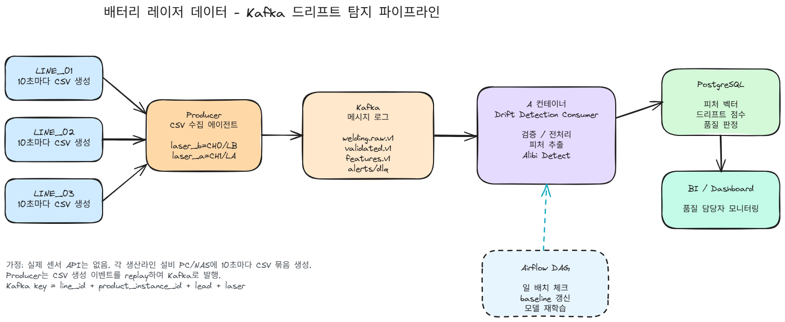

# Battery Welding Drift Detection - Kafka Collection Pipeline

배터리 레이저 용접 공정의 레이저 A, 레이저 B 데이터를 Kafka로 수집하는 과제 제출용 프로젝트입니다.

이 프로젝트는 실시간 센서 API가 없는 상황을 가정합니다. 대신 각 생산라인의 설비 PC/NAS에 제품별 CSV 파일이 10초마다 생성된다고 보고, Producer가 파일을 제품/lead/channel 단위로 그룹핑한 뒤 큰 신호 파일을 청크로 나누어 Kafka에 발행합니다.

## 파이프라인 설계도



## 제출물 구성

```text
welding-kafka-submission/
├── producer.py
├── docker-compose.yml
├── Dockerfile.producer
├── pyproject.toml
├── uv.lock
├── requirements.txt
├── .env.example
├── README.md
└── docs/
    ├── pipeline_architecture.md
    ├── kafka_design.md
    ├── readme.png
    ├── message_schema.json
    ├── sample_message.json
    └── welding_drift_architecture_v2.svg
```

## 핵심 시나리오

N개의 생산라인에서 같은 배터리 모듈을 병렬 생산한다. 실제 센서 API는 없지만, 각 라인은 10초마다 새 제품의 레이저 A/B 센서 CSV를 저장한다고 가정한다. Producer는 이 파일 묶음을 새로 생성된 제품 데이터처럼 replay하여 Kafka에 발행한다. 이후 Consumer는 검증, 전처리, 피처 추출, 드리프트 탐지를 수행해 다음 공정 이동 여부를 판단한다.

```text
Line 01 CSV -> Producer L01
Line 02 CSV -> Producer L02
Line N  CSV -> Producer LN
                  -> Kafka welding.raw.v1
                  -> Validator / Feature / Drift Consumers
                  -> PostgreSQL / quality decision
```

## 실행 방법

Python 패키지는 `uv`로 관리합니다. 로컬 실행 전 `uv sync`로 `.venv`를 구성하세요.

### 1. 환경 파일 생성

```bash
cp .env.example .env
```

Windows PowerShell에서는 아래처럼 실행해도 됩니다.

```powershell
Copy-Item .env.example .env
```

EC2에서 실행할 경우 `.env`의 `KAFKA_EXTERNAL_HOST`를 EC2 public IP로 변경합니다.

```text
KAFKA_EXTERNAL_HOST=<EC2_PUBLIC_IP>
```

### 2. Kafka 실행

```bash
docker compose up -d zookeeper kafka kafka-init kafka-ui
```

Kafka UI:

```text
http://localhost:8080
```

### 3. 데이터 준비

`data/` 폴더에 CSV 파일을 넣습니다.

```text
data/
├── laser_a/
│   └── 20220417/
│       └── 20220417_battery_10_laser_a.csv
├── laser_b/
│   └── 20220417/
│       └── 20220417_battery_10_laser_b.csv
└── ...
```

지원하는 파일명 규칙:

```text
{date}_battery_{battery_id}_laser_{a|b}.csv
{date}_battery_{battery_id}_CH{channel}.csv
{date}_battery_{battery_id}_laser_{a|b}.csv
```

채널 매핑은 `internal_mapping.md` 기준을 따릅니다. `laser_a`/`MASKED_CH`은 `LA` 및 channel 1, `laser_b`/`MASKED_CH`은 `LB` 및 channel 0으로 처리됩니다.

### 4. Producer dry run

Kafka에 보내기 전에 파일이 정상적으로 인식되는지 확인합니다.

```bash
uv run python producer.py --data-dir ./data --dry-run
```

### 5. Producer 실행

로컬 Python 실행:

```bash
uv sync
uv run python producer.py --data-dir ./data --kafka localhost:29092 --speed 50
```

기본값은 생산라인 1대이며, 실제 센서 API 대신 라인별 CSV가 10초마다 생성된다고 가정합니다.

짧은 데모:

```bash
uv run python producer.py --data-dir ./data --kafka localhost:29092 --max-products 3 --speed 100
```

생산라인 4대 시뮬레이션:

```bash
uv run python producer.py --data-dir ./data --kafka localhost:29092 --line-count 4 --line-interval-seconds 10 --speed 50
```

중복 replay로 Kafka 부하 테스트:

```bash
uv run python producer.py --data-dir ./data --kafka localhost:29092 --target-products 2000 --line-count 4 --speed 200 --no-schedule-wait
```

Docker로 Producer 실행:

```bash
docker compose up --build producer
```

## Producer CLI 옵션

| 옵션 | 기본값 | 설명 |
|---|---:|---|
| `--data-dir` | 필수 | CSV 파일 루트 디렉토리 |
| `--kafka` | `localhost:29092` | Kafka bootstrap server |
| `--topic` | `welding.raw.v1` | 발행 topic |
| `--chunk-size` | `5000` | 메시지 하나에 담을 sample 수 |
| `--speed` | `50` | 한 제품 안에서 신호 chunk를 재생하는 배속 |
| `--line-count` | `1` | 시뮬레이션할 생산라인 수 |
| `--line-interval-seconds` | `10` | 생산라인 1대에서 새 CSV 묶음이 생성되는 간격 |
| `--no-schedule-wait` | false | 라인 간격 대기 없이 chunk 배속만으로 빠르게 발행 |
| `--target-products` | `0` | 중복 replay 포함 목표 제품 수 |
| `--max-products` | 없음 | 데모용 원본 제품 수 제한 |
| `--only-complete` | false | 16개 레이저 A/B pair가 있는 제품만 발행 |
| `--loop` | false | 반복 replay |
| `--dry-run` | false | Kafka 발행 없이 스캔 결과만 출력 |

## Kafka topic

| Topic | 역할 |
|---|---|
| `welding.raw.v1` | 원시 센서 신호 청크 |
| `welding.validated.v1` | 검증 통과 신호 |
| `welding.features.v1` | bead 단위 피처 |
| `welding.quality_decision.v1` | 다음 공정 이동 여부 |
| `welding.dlq.v1` | 처리 불가 데이터 격리 |

## Partition key

```text
{line_id}_{product_instance_id}_L{lead_num}_{laser_id}
```

이 key를 사용하면 같은 생산라인, 같은 제품, 같은 lead, 같은 레이저 채널의 청크가 같은 파티션에 순서대로 저장됩니다.

## 메시지 예시

전체 예시는 [`docs/sample_message.json`](docs/sample_message.json)에 있습니다.

```json
{
  "message_id": "20220417_000442_1_WLINE_01_04_PROD_001:L01:LB:000000",
  "product_instance_id": "20220417_000442_1_WLINE_01_04_PROD_001",
  "product_id": "PROD_001",
  "line_id": "WLINE_01",
  "lead_num": 1,
  "lead_type": "AL_CU",
  "channel": 0,
  "chunk_index": 0,
  "total_chunks": 4,
  "is_last_chunk": false,
  "event_time": "2022-04-17T00:04:42Z",
  "metadata": {
    "source": "file_replay_producer",
    "version": "v1",
    "is_duplicate": false
  }
}
```

## 설계 문서

- 파이프라인 구성도: [`docs/pipeline_architecture.md`](docs/pipeline_architecture.md)
- SVG 설계도: [`docs/welding_drift_architecture_v2.svg`](docs/welding_drift_architecture_v2.svg)
- Kafka 수집 설계: [`docs/kafka_design.md`](docs/kafka_design.md)
- 메시지 스키마: [`docs/message_schema.json`](docs/message_schema.json)
- 메시지 예시: [`docs/sample_message.json`](docs/sample_message.json)

## GitHub 업로드

```bash
git init
git add .
git commit -m "feat: add welding kafka collection pipeline"
git branch -M main
git remote add origin https://github.com/<your-id>/<repo-name>.git
git push -u origin main
```

## 제출 체크리스트

- [x] `producer.py`
- [x] `docker-compose.yml`
- [x] Kafka 실행 환경
- [x] 파이프라인 구성도 문서
- [x] Kafka 수집 설계 문서
- [x] Producer 코드 흐름 설명
- [x] 데이터 수집 로직 설명
- [x] 메시지 생성 방식 설명
- [x] Error handling 전략
- [x] 메시지 JSON 예시
- [x] Topic 이름, 개수, 역할
- [x] Partitioning 전략과 key 선택 이유
- [x] Configuration 설정

