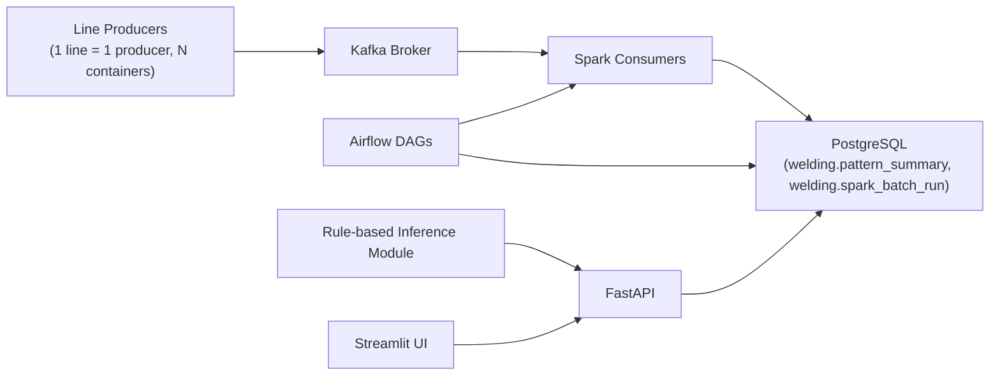

# 7차시 계획 (API / Inference 연동)

작성일: 2026-05-04  
적용 범위: **실험 종료 후 적용** (현재 운영 중 컨테이너/실험에 영향 금지)

## 0) 이번 계획의 원칙

- 현재 실행 중인 실험(Producer/Consumer/Airflow/Kafka/Spark/Prometheus/Grafana)은 **중단/수정하지 않는다**.
- 7차시 작업은 문서화만 먼저 완료하고, 실험 종료 후 별도 브랜치에서 순차 적용한다.
- API/프론트는 기존 파이프라인 결과(DB 적재 결과)를 조회하는 방식으로 붙여서 리스크를 최소화한다.
- 운영 기준을 **생산라인 1대 = 프로듀서 1개(컨테이너 1개)** 로 고정한다.

---

## 1) 목표

6차시까지 구축한 파이프라인(Kafka -> Spark -> Storage/DB -> Airflow) 위에

1. FastAPI 기반 조회/추론 API 추가
2. Streamlit 기반 대시보드 추가
3. 간단한 룰 기반 inference 추가 (채널별 추론 시간 차이 반영)

을 구현하여 7차시 제출 요구사항(설계 + 실행 가능한 코드 + 데모)을 충족한다.

---

## 2) 최종 아키텍처(7차시)



핵심 흐름:
- 데이터 처리 결과는 DB에 저장
- FastAPI는 DB 조회 + 룰 기반 추론 수행
- Streamlit은 FastAPI를 호출해 모니터링/조회/추론 결과 표시
- 라인 수 증가는 `line_count` 파라미터만이 아니라 **producer 컨테이너 수 증가**로 반영한다.

---

## 3) 기술 선택

### Backend: FastAPI
- 비동기 처리와 Swagger 문서(`/docs`) 자동 생성
- 응답 스키마(Pydantic)로 발표/검증이 쉬움
- 기존 Python 코드베이스와 자연스럽게 결합

### Frontend: Streamlit
- 초심자에게 구현 속도가 가장 빠름
- 테이블/차트/필터 UI를 코드 몇 개로 구현 가능
- FastAPI 호출만으로 데모 페이지 구성 가능

### Inference: Rule-based (더미)
- 아직 실모델이 없는 상태에서 7차 요구사항 충족
- 이후 `inference/model.py`만 교체하여 실제 모델로 확장 가능

---

## 4) API 설계 (초안)

기본 prefix: `/api/v1`

### 4.1 헬스체크
- `GET /health`
- 용도: API 서버 상태 확인
- 응답: `{ "status": "ok", "time": "..." }`

### 4.2 최신 품질 결과
- `GET /api/v1/quality/latest?limit=50`
- 용도: 최근 적재 결과 조회
- 소스: `welding.pattern_summary`

### 4.3 이력 조회
- `GET /api/v1/quality/history?start_date=YYYY-MM-DD&end_date=YYYY-MM-DD&line_id=LINE_01&channel=laser_a`
- 용도: 기간/라인/채널 필터 조회
- 소스: `welding.pattern_summary`

### 4.4 배터리 단건 조회
- `GET /api/v1/batteries/{product_id}`
- 용도: 특정 배터리의 laser_a/laser_b 처리 결과 조회
- 소스: `welding.pattern_summary`

### 4.5 배치 실행 메타 조회
- `GET /api/v1/runs/{run_id}`
- 용도: run 상태, row 수, 시작/종료 시각, `line_count`/`producer_count` 확인
- 소스: `welding.spark_batch_run`

### 4.6 더미 추론
- `POST /api/v1/inference/predict`
- 입력 예시:
```json
{
  "product_id": "20220417_battery_001",
  "channel": "laser_a",
  "features": {
    "cpd_score": 0.032,
    "odd_even_gap": 0.011,
    "record_count": 16
  }
}
```
- 응답 예시:
```json
{
  "product_id": "20220417_battery_001",
  "channel": "laser_a",
  "decision": "normal",
  "score": 0.18,
  "threshold": 0.7,
  "inference_ms": 18,
  "model_version": "rule-v1"
}
```

---

## 5) 룰 기반 추론 설계 (채널별 추론 속도 반영)

## 5.1 채널별 지연 가정
- `laser_a`: 평균 18ms (예: 12~25ms 랜덤)
- `laser_b`: 평균 35ms (예: 28~45ms 랜덤)

설계 의도:
- 실제 운영에서 채널별 모델 복잡도 차이(특징 수, 전처리량, 모델 크기)가 있을 수 있음을 반영
- 발표 시 “동일 입력량이어도 채널별 레이턴시가 다를 수 있음”을 설명 가능

## 5.2 추론 룰(초기)
- 입력 feature: `cpd_score`, `odd_even_gap`, `record_count`
- score 계산(예시):
  - `score = 0.6*cpd_score_norm + 0.3*gap_norm + 0.1*count_penalty`
- 판정:
  - `score >= 0.7 -> drift`
  - else `normal`

## 5.3 구현 포인트
- 추론 함수에서 채널에 따라 `sleep` 지연을 다르게 둠
- 응답에 `inference_ms`를 반드시 포함
- 추후 실모델 연동 시 `sleep` 제거 + 실제 추론 시간 기록

---

## 6) Streamlit 화면 설계

페이지 구성:

1. **Overview**
- 최근 run 상태, 최근 처리 건수, 평균 추론 시간(채널별)
- `line_count`와 `producer_count`를 함께 표시(1:1 매핑 검증)

2. **Quality History**
- 기간/라인/채널 필터
- line chart(cpd_score), table(quality_decision)

3. **Battery Detail**
- product_id 입력 -> laser_a/laser_b 결과 비교

4. **Inference Demo**
- 샘플 입력값 넣고 예측 실행
- 결과 + `inference_ms` 표시

---

## 7) 코드 구조 계획

```text
welding-kafka-submission/
  api/
    main.py
    deps.py
    routes/
      health.py
      quality.py
      runs.py
      inference.py
    models/
      requests.py
      responses.py
    services/
      query_service.py
  inference/
    model.py
  frontend/
    app.py
  docs/
    7차시 계획.md
```

---

## 8) docker-compose 반영 계획 (실험 종료 후)

추가 서비스:
- `welding-api` (FastAPI)
- `welding-frontend` (Streamlit)

환경변수 공통화:
- `POSTGRES_HOST`
- `POSTGRES_PORT`
- `POSTGRES_DB`
- `POSTGRES_USER`
- `POSTGRES_PASSWORD`

원칙:
- DB 비밀번호 하드코딩 금지
- `.env` + compose variable 치환

---

## 9) 실행/검증 절차 (실험 종료 후 체크리스트)

1. 새 브랜치 생성
2. API/Frontend 파일 생성
3. 로컬 단위 실행(`uv run`)
4. docker-compose에 서비스 추가 후 기동
5. API 엔드포인트 검증
   - `/health`
   - `/api/v1/quality/latest`
   - `/api/v1/quality/history`
   - `/api/v1/inference/predict`
6. Streamlit 화면 검증
7. README/발표 스크립트 반영
8. 라인/프로듀서 동시성 검증
   - `line_count=N`일 때 producer 컨테이너가 `N`개 떠 있는지 확인
   - 라인별 로그가 `LINE_01 ... LINE_N`으로 분리되어 출력되는지 확인

---

## 10) 7차시 제출물 매핑

1) 파이프라인 구성도 업데이트  
- 본 문서의 mermaid 구조를 Excalidraw/Notion으로 이관

2) API 서빙 설계  
- Endpoint, 포맷, 데이터소스 명시 완료

3) 모델 Inference 연동  
- 룰 기반 더미 inference + 채널별 latency 반영

4) 실행 가능한 코드  
- `api/*`, `inference/model.py`, `frontend/app.py`, `docker-compose` 확장 예정

---

## 11) 리스크와 대응

- 리스크: 현재 실험 중인 컨테이너에 영향
  - 대응: 지금은 문서만 작성, 코드/compose 변경 보류

- 리스크: DB 스키마 불일치
  - 대응: 구현 시 `welding.pattern_summary`, `welding.spark_batch_run` 기준으로 SQL 고정

- 리스크: 채널명 혼선(`0/1` vs `laser_a/laser_b`)
  - 대응: API/프론트 표준 표기는 `laser_a`, `laser_b`로 통일

- 리스크: 생산라인과 프로듀서 매핑 불일치
  - 대응: 실험/운영 스크립트에서 `producer_count = line_count`를 기본값으로 강제하고, run 메타에 둘 다 기록

---

## 12) 결정 사항(확정)

- Frontend: **Streamlit**
- Inference: **간단 더미/룰 기반**
- 채널별 추론속도 차이: **반영** (`laser_a` vs `laser_b`)
- 현재 실험 중 영향 가능 시: **즉시 구현 금지, 계획 우선**
- 라인 모델: **생산라인 1대 = 프로듀서 1개(컨테이너 1개)**

