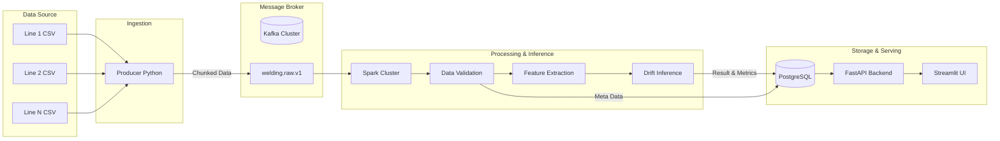

# 🚀 배터리 용접 공정 이상 탐지 파이프라인 (8회차 최종 발표)

## 📌 3줄 요약 (TL;DR) & 주요 달성 성과
1. **센서 API 부재 상황 극복**: 설비 PC에 저장되는 CSV 파일을 실시간 스트리밍 데이터처럼 Replay하여 Kafka로 전송하는 Custom Producer 파이프라인 구축
2. **분산 처리 기반 인프라**: 대용량 센서 데이터를 Kafka와 Spark를 통해 안정적으로 수집 및 전처리하고, PostgreSQL과 Data Lake에 적재하는 End-to-End 시스템 완성
3. **One-Stop 통합 대시보드**: Streamlit과 FastAPI 연동을 통해 파이프라인(실험) 가동부터 실시간 데이터 처리 현황(Auto-refresh) 모니터링까지 하나의 화면에서 제어 가능한 데모 환경 구축

---

## 1. 프로젝트 개요 및 목적
본 프로젝트는 배터리 레이저 용접 공정에서 발생하는 대용량 센서 데이터를 실시간으로 수집, 처리, 분석하여 용접 품질의 이상(Drift)을 조기에 탐지하는 데이터 엔지니어링 파이프라인을 구축하는 것을 목적으로 합니다.
실제 센서 API가 없는 공장 환경을 가정하여 생산 라인별로 주기적으로 생성되는 CSV 파일을 데이터 소스로 활용하며, 이를 안정적으로 수집하고 모델 추론까지 연계하는 자동화된 시스템을 목표로 하였습니다.

---

## 2. 전체 아키텍처 및 파이프라인 구성

### 파이프라인 단계별 요약
1. **데이터 수집 (Ingestion)**: Python Producer가 10초 주기로 CSV 파일을 읽어 대용량 데이터를 Chunk로 분할하여 Kafka로 발행합니다.
2. **데이터 처리 (Processing)**: Kafka에 적재된 데이터를 Spark가 소비하여 무결성 검증, 이상치 제거 및 머신러닝을 위한 피처(Feature)를 추출합니다.
3. **데이터 저장 (Storage)**: 가공된 데이터는 Parquet 형태로 스토리지에, 메타데이터와 성능 결과는 PostgreSQL에 적재됩니다.
4. **API 및 대시보드 (Serving)**: FastAPI 백엔드를 거쳐 Streamlit 대시보드에서 최종 결과를 시각화합니다.

---

## 3. 데모 시연 핵심 포인트 (UI/UX 개선 사항)

이번 시연을 위해 파이프라인의 역동성을 가장 잘 보여줄 수 있도록 대시보드(UI)를 집중적으로 개선했습니다.

- 🎛️ **Experiment Control (실험 제어)**
  - 터미널이나 백엔드 환경에 접속할 필요 없이, 대시보드에서 클릭 한 번으로 생산라인 수, 속도 등을 설정하고 **파이프라인 시뮬레이션을 직접 가동**할 수 있습니다.
- ⚡ **Real-time Monitoring (실시간 모니터링)**
  - 파이프라인이 가동되면서 쏟아져 들어오는 데이터와 처리 결과를 탭 이동이나 새로고침 없이 **Auto-refresh를 통해 실시간 애니메이션처럼 시각화**하여 보여줍니다.
- 🧪 **데이터 파이프라인 검증 (Rule-based Inference)**
  - 현재 모델 추론부는 완벽한 ML 모델이 아닌 임시 룰(Rule-based Placeholder)이 적용되어 있습니다. 본 시연은 ML 성능보다 **대규모 데이터가 유실 없이 실시간으로 흘러가는 파이프라인(Data Engineering)의 안정성과 완전성을 입증**하는 데 집중합니다.

---

## 4. 기술/구조 선택의 이유와 트레이드오프

### 기술적 의사결정
- **Kafka 도입**: 고주파 센서 데이터를 유실 없이 안정적으로 버퍼링하고, 여러 컨슈머(Spark, DB 등)가 독립적으로 활용할 수 있도록 Pub-Sub 구조를 채택했습니다.
- **Spark 처리**: 분산 컴퓨팅을 통해 향후 데이터량이 급증하더라도 스케일 아웃이 용이하며, 배치와 스트리밍 처리를 동일한 엔진에서 유연하게 다루기 위해 선택했습니다.

### 트레이드오프 (Trade-off)
- **구축 복잡도 vs 확장성**: Kafka와 Spark 클러스터 인프라 관리 비용이 증가하지만, 대용량 트래픽에 대한 높은 확장성과 장애 대응 능력(안정성)을 확보했습니다.
- **실시간성 vs 신뢰성**: 마이크로초 단위의 완전한 실시간 처리보다는 Chunk 단위의 미니 배치 처리를 통해, 누락 검증 등 데이터의 정합성과 신뢰성을 우선시했습니다.

---

## 5. 프로젝트 회고 및 확장 가능성

### 👍 잘 된 점
- Airflow를 활용한 전 구간 오케스트레이션 적용엔 다소 한계가 있었으나, **수집 ➡️ 전처리 ➡️ 판정 ➡️ 저장 ➡️ 시각화**로 이어지는 탄탄한 **End-to-End 데이터 파이프라인 뼈대**를 성공적으로 구축했습니다.

### 😢 아쉬운 점
- 고정된 로컬 파일(CSV)을 읽어오는 방식이다 보니, 실제 오픈 API(뉴스, 주식 등)처럼 마르지 않고 유입되는 실시간 스트리밍의 역동성을 체감하기에는 한계가 있어 아쉬웠습니다.
- Airflow에 대한 이해 부족으로 Asset 방식, TriggerDagRunOperator 등의 최적 선택에 우왕좌왕하는 시간이 있었습니다.

### 🚀 확장 가능성 (Future Work)
- **동적 스케일아웃(Dynamic Scale-out) 아키텍처**
  - 현재 구조에서 유입량이 폭증해 컨슈머(Spark)가 처리량 한계/위험 수준에 도달할 경우, 이를 자동으로 감지해 **컨슈머 컨테이너를 추가 실행하고 파티션별 부하를 능동적으로 분산**시키는 고가용성 스트리밍 환경으로 발전시킬 계획입니다.
