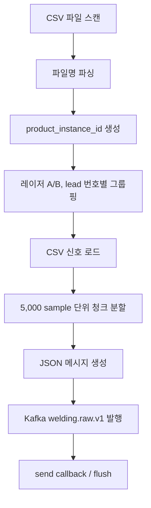

# Kafka 수집 설계

## 1. Producer 코드 흐름

실제 센서 API는 없다고 가정한다. 대신 각 생산라인의 설비 PC/NAS에 제품별 CSV 묶음이 10초마다 생성되고, Producer는 이 파일 생성 이벤트를 Kafka 메시지로 replay한다.



### 데이터 수집 로직

파일명 형식은 아래 규칙을 따른다.

```text
{date}_battery_{battery_id}_laser_{a|b}.csv
{date}_{time}_{seq}_{line}_{batch}_{product_id}_{lead_num}_{laser_id}.csv
예: 20220417_000442_1_WLINE_01_04_PROD_001_01_LB.csv
```

Producer는 `date + time + seq + line + batch + product_id`로 `product_instance_id`를 만든다.
`product_id`만 쓰지 않는 이유는 여러 날짜나 여러 생산라인에서 같은 제품 ID가 반복될 수 있기 때문이다.

## 2. 메시지 생성 방식

제품 1개는 최대 16개 lead와 2개 채널(레이저 A, 레이저 B)을 가진다.
각 CSV는 25kHz 신호이며, 기본 5,000 sample 단위로 나눠 Kafka에 발행한다.

```text
1 chunk = 5,000 samples = 0.2 seconds
10MB~20MB CSV = 여러 개의 Kafka message로 분할 전송
```

생산라인 식별을 명확히 하기 위해 메시지 `metadata.file_name`에는
원본 파일명 앞에 `"{line_number}_"` 접두어를 붙인다.

```text
예) 3_20220417_battery_10_laser_b.csv
```

메시지 예시는 [`sample_message.json`](sample_message.json)을 참고한다.
전체 스키마는 [`message_schema.json`](message_schema.json)에 정의했다.

## 3. Error handling 전략

### 유실 방지

Producer 설정:

```text
acks = all
retries = 10
max_in_flight_requests_per_connection = 1
request_timeout_ms = 30000
delivery_timeout_ms = 120000
compression_type = gzip
```

`acks=all`은 브로커가 메시지를 저장한 뒤 응답하게 해 데이터 유실 가능성을 낮춘다.
일시적인 네트워크 오류는 `retries`로 재시도한다.

### 중복 처리

Kafka Producer는 장애 상황에서 at-least-once 전송을 선택한다.
따라서 아주 드문 경우 같은 메시지가 중복 저장될 수 있다.
이를 처리하기 위해 모든 메시지에 결정론적 `message_id`를 넣었다.

```text
message_id = product_instance_id + lead_num + laser_id + chunk_index
```

Consumer나 DB 저장 단계에서는 `message_id` 또는 feature key를 unique key로 사용해 중복 저장을 방지한다.

### 재생 데이터 중복

보유 데이터 수가 부족해 Kafka 부하 테스트를 할 때는 같은 원본을 여러 번 replay할 수 있다.
이 경우 메시지에 아래 값을 넣는다.

```json
{
  "metadata": {
    "is_duplicate": true,
    "original_product_instance_id": "20220417_000442_1_WLINE_01_04_PROD_001",
    "replay_iteration": 1
  }
}
```

이 중복 replay 데이터는 Kafka 처리량 테스트와 장애 복구 테스트에만 사용하고, ML 학습에서는 제외한다.

## 4. Topic 구성

| Topic | Partition | Retention | 역할 |
|---|---:|---:|---|
| `welding.raw.v1` | 8 | 7일 | Producer가 발행하는 원시 신호 청크 |
| `welding.validated.v1` | 8 | 7일 | Validator를 통과한 신호 |
| `welding.features.v1` | 8 | 30일 | bead 단위 피처 |
| `welding.quality_decision.v1` | 4 | 30일 | 다음 공정 이동 여부, PASS/WARNING/HOLD |
| `welding.dlq.v1` | 4 | 7일 | 손상 파일, 누락 청크, 심각한 검증 실패 격리 |

## 5. Partitioning 전략

`welding.raw.v1`의 partition key:

```text
{line_id}_{product_instance_id}_L{lead_num}_{laser_id}
예: WLINE_01_20220417_000442_1_WLINE_01_04_PROD_001_L01_LA
```

### 선택 이유

- 같은 제품, 같은 lead, 같은 channel의 청크가 같은 파티션에 들어가므로 순서가 보장된다.
- `line_id`를 포함해 N개 생산라인 데이터를 라인 단위로 추적할 수 있다.
- Producer는 기본 1개 생산라인을 사용하며, `--line-count`로 라인 수를 늘릴 수 있다.
- 각 라인은 기본 10초(`--line-interval-seconds`)마다 새 CSV 묶음이 생성된 것으로 스케줄링된다.
- `timestamp`를 key로 쓰면 같은 시간대 데이터가 한 파티션에 몰릴 수 있다.
- `random` key를 쓰면 같은 신호의 청크 순서 보장이 깨진다.
- `product_id` 단독 key는 날짜/라인/배치가 다른 동일 제품을 구분하지 못한다.

## 6. Configuration 설정

Docker Compose에서 broker와 topic에 아래 설정을 적용했다.

```text
KAFKA_AUTO_CREATE_TOPICS_ENABLE = false
KAFKA_NUM_PARTITIONS = 8
KAFKA_DEFAULT_REPLICATION_FACTOR = 1
KAFKA_MESSAGE_MAX_BYTES = 5242880
KAFKA_LOG_RETENTION_HOURS = 168
```

로컬/EC2 단일 브로커 과제 환경이므로 replication factor는 1로 설정했다.
운영 환경에서는 broker를 3대 이상 두고 replication factor를 3으로 높이는 것이 적절하다.

## 7. 데모 시나리오

1. Docker Compose로 Kafka와 Kafka UI를 실행한다.
2. `.env`의 `DATA_DIR`에 지정한 로컬 전용 폴더에 CSV 파일을 둔다.
3. Producer를 실행해 `welding.raw.v1`에 메시지를 발행한다.
4. Kafka UI에서 topic, partition, message key, JSON payload를 확인한다.
5. `metadata.file_name`이 `{line_number}_원본파일명` 규칙으로 발행되는지 확인한다.

짧은 데모:

```bash
uv run python producer.py --kafka localhost:29092 --max-products 3 --speed 100
```

부하 테스트:

```bash
uv run python producer.py --kafka localhost:29092 --target-products 2000 --line-count 4 --speed 200 --no-schedule-wait
```

