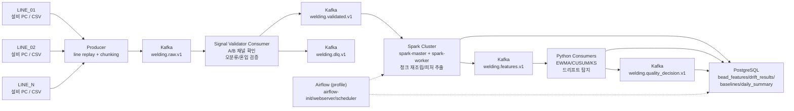

# 파이프라인 구성도

## 프로젝트 시나리오

실시간 센서 API를 직접 받을 수 없으므로, 제조 현장에서 흔한 파일 기반 수집 구조를 가정한다.
N개의 용접 생산라인은 10초마다 새 제품의 레이저 A, 레이저 B 데이터 CSV 파일을 설비 PC 또는 NAS에 저장한다고 본다.
Producer는 이 파일 묶음을 제품 단위로 감지하고 Kafka에 청크 단위로 발행한다.

핵심 목적은 하루치 사후 분석이 아니라, 용접 공정 이후 다음 공정으로 불량이 흘러가지 않도록 공정 사이에 품질 게이트를 두는 것이다.

## 구성도

제출용 SVG 설계도는 [`welding_drift_architecture_v2.svg`](welding_drift_architecture_v2.svg)에 함께 저장했다.
아래 Mermaid 구성도는 Notion 문서에 바로 붙여 넣어 설명할 수 있는 버전이다.



## 기술별 역할

| 기술 | 역할 |
|---|---|
| Kafka | 여러 생산라인의 센서 파일을 청크 단위로 안정적으로 수집하고 재처리 가능한 로그로 보관 |
| Producer | 10초마다 생성된 것으로 가정한 CSV 파일을 제품/lead/channel 단위로 그룹핑하고 raw topic에 발행 |
| Signal Validator | 채널 쌍 누락/신호 오분류/혼입 여부를 점검해 validated와 DLQ로 분기 |
| Consumer | Kafka topic을 읽어 검증, 전처리, 피처 추출, 품질 판정을 수행 |
| Spark | `spark-master`/`spark-worker` 기반 병렬 피처 추출과 라인별 집계를 담당 |
| Airflow | `profile` 기반 선택 실행. 일별 리포트, baseline 갱신, 모델 재학습 같은 배치 작업 스케줄링 |
| PostgreSQL | 피처, 품질 판정, 드리프트 결과, 재처리 이력 저장 |

## 컨테이너 통신 기준

```text
Kafka      : kafka:9092
Spark      : spark://spark-master:7077
PostgreSQL : postgres:5432
Airflow UI : localhost:18088 (선택 실행)
```

## Kafka가 필요한 이유

- N개 생산라인에서 10초 간격으로 데이터가 들어와도 producer를 독립적으로 운영할 수 있다.
- 제품 1개당 10MB에서 20MB의 큰 신호를 청크로 나눠 안정적으로 보낼 수 있다.
- Consumer 장애가 발생해도 offset 기준으로 다시 읽어 재처리할 수 있다.
- raw, validated, features, decision topic을 분리해 처리 단계를 독립적으로 확장할 수 있다.
- 같은 원본 데이터를 반복 replay해 Kafka 처리량과 장애 복구 데모를 할 수 있다.
