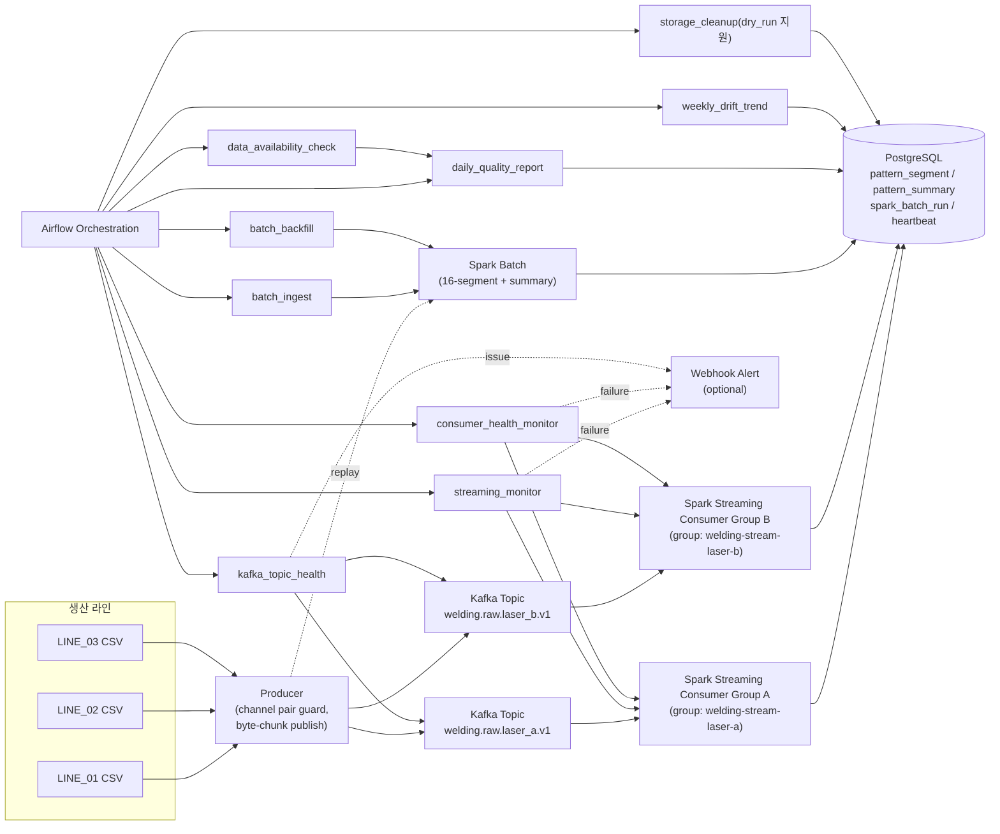

# 프로젝트 방향성 변화 분석 (기준일: 2026-04-29)

## 기준 커밋
- 2026-04-23 마지막 커밋: `22564ec` (`docs: update diagram schema and add 4th session progress report`)
- 2026-04-27 마지막 커밋: Git 기록상 없음
- 2026-04-27 대체 기준(가장 근접한 다음 운영 전환 커밋): `373b5b0` (2026-04-28)
- 오늘 최신 커밋: `db87330` (`fix: harden airflow DAG run binding, alerts, and health checks`)

## 1) 프로젝트 방향성 변화 요약

### A. 4/23 단계 (`22564ec`)
- 방향: Kafka + Spark 중심의 "데이터 처리 기능 구현" 단계
- 초점:
  - CSV 기반 이벤트 발행
  - Spark 처리/적재 로직 초기 구현
  - 다이어그램/문서 보강
- 한계:
  - 운영 오케스트레이션(스케줄/재시도/헬스체크)이 약함
  - 장애 대응 자동화가 부족함

### B. 4/28 단계 (`373b5b0`, 4/27 대체 기준)
- 방향: "운영 자동화(Orchestration) 중심"으로 전환
- 초점:
  - Airflow DAG 다수 도입
  - backfill/availability/consumer health/topic health/cleanup/weekly trend 등 운영 DAG 체계화
  - 상시 운영용 스크립트 및 계측 스크립트 추가
- 성과:
  - 작업 순서/의존성/스케줄이 코드화됨
  - 운영 작업의 반복성과 재현성이 높아짐
- 드러난 문제:
  - 일부 DAG 검증 정합성(`run_id` 결합) 부족
  - 헬스체크 예외 시 정상 분기되는 위험
  - 외부 알림 부재

### C. 오늘 단계 (`db87330`)
- 방향: "운영 안정성 + 정확성 강화" 단계
- 초점:
  - DAG-실행 단위 정합성 강화 (`run_id` 바인딩)
  - 모니터링/복구 로직의 실패 은닉 제거
  - Kafka lag 해석 강화(미할당/파싱 오류 감지)
  - cleanup `dry_run` 실구현
  - webhook 알림 채널 추가
- 결과:
  - 파이프라인이 "기능 구현"에서 "안전 운영 가능한 상태"로 진화

## 2) 오늘 시점 최종 방향성 다이어그램

## 3) 날짜별 마지막 커밋 간 차이 + 수정된 문제

## 비교 1: `22564ec` (4/23) -> `373b5b0` (4/28, 4/27 대체)
- 변경량: 28 files, +4582 / -48
- 핵심 변화:
  - Airflow DAG 체계 본격 도입
  - 운영/복구/정리/백필 자동화 스크립트 확장
  - streaming/batch 계측 및 검증 SQL 추가
  - Spark streaming 코드 본격 추가
- 해결하려던 문제:
  - 수동 운영 의존
  - 실패 시 추적 어려움
  - 재실행/백필 절차 부재
- 남은 문제:
  - 일부 DAG 검증 정확도(실행 run 매핑) 미흡
  - 알림 채널의 실시간성 부족(DB heartbeat 중심)

## 비교 2: `373b5b0` (4/28) -> `db87330` (오늘)
- 변경량: 10 files, +568 / -114
- 핵심 변화:
  - `welding_batch_ingest`: `run_id` 단위 검증으로 오검증 방지
  - `welding_streaming_monitor`: 예외 시 정상 분기 제거
  - `welding_consumer_health_monitor`: 재기동 실패 외부 알림
  - `welding_kafka_topic_health`: lag 파싱 강화 + unassigned/parse_error 감지
  - `welding_storage_cleanup`: `dry_run` 실제 구현
  - producer/streaming/테스트 보강
- 해결된 문제:
  - 장애 은닉 가능성 감소
  - 운영자 알림 가시성 개선
  - 검증 신뢰도 상승

## 비교 3: `22564ec` (4/23) -> `db87330` (오늘)
- 변경량: 28 files, +5042 / -54
- 결론:
  - 프로젝트 성격이 "처리 로직 구현"에서 "운영 가능한 데이터 플랫폼"으로 전환됨
  - DAG/운영 자동화/모니터링/복구/정합성 검증이 핵심 축으로 자리잡음

## 현재 시점의 남은 리스크 (추가 개선 후보)
- 데이터 폴더명-파일명 채널 불일치 경고 다수(운영상 혼동 위험)
- 컨슈머 수를 크게 늘렸을 때 노트북 리소스 한계로 처리 지연 가능
- Webhook 실패 재시도/백오프 정책은 추가 여지 있음
