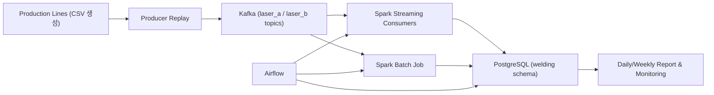
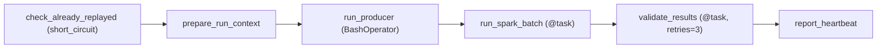
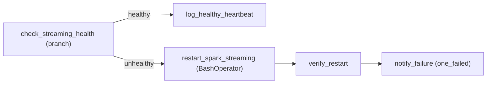
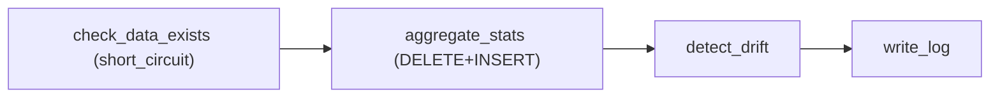

# 5회차 제출 문서: Airflow DAG 설계 (오케스트레이션/스케줄/재시도)

## 1) 파이프라인 구성도 업데이트

### 1.1 전체 구조 (배치 + 스트리밍 운영)

### 1.2 Airflow 역할 분리
- 배치: `welding_batch_ingest`가 Producer 실행 -> Spark Batch 실행 -> 검증 -> heartbeat 기록
- 스트리밍: Spark consumer는 상시 실행, Airflow는 헬스체크/리커버리/리포트 담당
- 모니터링: consumer health, streaming health, topic health, daily/weekly report

---

## 2) DAG 설계

## 2.1 구현된 DAG 목록

| DAG ID | 목적 | 스케줄 | 비고 |
|---|---|---|---|
| `welding_batch_ingest` | 배치 재생+검증 파이프라인 | `*/15 * * * *` | 핵심 배치 DAG |
| `welding_streaming_monitor` | 스트리밍 헬스체크/재기동 | `*/10 * * * *` | branch + restart |
| `welding_consumer_health_monitor` | 채널별 consumer 그룹 수 검증/복구 | `*/5 * * * *` | group 멤버 수 기반 |
| `welding_daily_quality_report` | 전일 집계/드리프트 요약 | `0 1 * * *` | `catchup=True` |
| `welding_data_availability_check` | 전일 데이터 가드 | `30 0 * * *` | report 선행 가드 |
| `welding_batch_backfill` | 특정 날짜 수동 소급 처리 | `schedule=None` | 수동 트리거 |
| `welding_weekly_drift_trend` | 주간 추세 요약 | `0 9 * * MON` | 보고 고도화 |
| `welding_kafka_topic_health` | 토픽/지연 상태 점검 | `0 * * * *` | 운영 점검 |
| `welding_storage_cleanup` | 저장소 정리 | `0 3 * * *` | 운영 정리 |

> 실제 5회차 발표에서는 `welding_batch_ingest`, `welding_streaming_monitor`, `welding_daily_quality_report`를 중심으로 설명.

---

## 2.2 핵심 DAG 상세

### A. `welding_batch_ingest`

#### 목적/실행 단위
- 목적: Kafka->Spark Batch->DB 적재를 15분 주기로 오케스트레이션
- 실행 단위: 1회 실행(run)당 1개 배치 처리

#### 입력/출력
- 입력:
  - 원본: `/data` 하위 CSV
  - 토픽: `welding.raw.laser_a.v1`, `welding.raw.laser_b.v1`
  - 런타임: `run_id(UUID)` 생성
- 출력:
  - `welding.spark_batch_run`
  - `welding.pattern_segment`
  - `welding.pattern_summary`
  - `welding.pipeline_heartbeat`

#### 태스크 구조/의존성

#### 태스크 간 데이터 전달
- `prepare_run_context` -> `run_spark_batch`/`validate_results`: TaskFlow return value (XCom)
- `run_id`를 Spark Batch CLI 인자로 전달하여 결과 검증 대상을 특정

#### 스케줄/시작일/타임존
- schedule: `*/15 * * * *`
- start_date: `2026-04-01`
- timezone: Airflow 기본 타임존(환경값 미설정 시 기본 UTC)

#### Retry/Backoff/Failure handling
- DAG default retries: 2
- `validate_results`: retries=3, retry_delay=2m
- 의미 있는 retry:
  - DB 연결 일시 실패
  - Spark 작업 일시 실패
- 의미 없는 retry(설계상):
  - 데이터 자체 없음/품질 불충분(검증에서 실패 처리)

#### Idempotency
- `check_already_replayed`로 같은 event_date 재실행 차단(heartbeat 기반)
- `run_id` 단위로 결과를 검증해 이전 run과 혼동 방지

---

### B. `welding_streaming_monitor`

#### 목적/실행 단위
- 목적: 최근 윈도우에서 채널별 데이터 유입이 끊겼을 때 스트리밍 consumer를 자동 재기동
- 실행 단위: 10분마다 1회 헬스체크

#### 입력/출력
- 입력:
  - `welding.pattern_summary` 최근 `HEALTH_WINDOW_MIN`(기본 15분) 집계
- 출력:
  - 정상 heartbeat 또는 재시작 실행 로그/heartbeat

#### 태스크 구조/의존성

#### 태스크 간 데이터 전달
- 분기 결과(task id)로 branch 제어
- DB heartbeat 기록으로 상태 추적

#### 스케줄/시작일/타임존
- schedule: `*/10 * * * *`
- start_date: `2026-04-01`
- timezone: Airflow 기본(UTC)

#### Retry/Backoff/Failure handling
- default retries=1
- 실패 시 `notify_failure` 실행(`trigger_rule=one_failed`)
- 웹훅(`ALERT_WEBHOOK_URL`) 연동 가능

#### Idempotency
- 재기동 명령은 기존 `spark_streaming.py` 프로세스를 종료 후 재시작
- 동일 group id 재사용으로 offset 이어받기

---

### C. `welding_daily_quality_report`

#### 목적/실행 단위
- 목적: 전일 데이터를 집계해 일일 품질 보고/드리프트 경보 생성
- 실행 단위: 하루 1회

#### 입력/출력
- 입력:
  - `welding.pattern_summary` (target_date = ds - 1)
- 출력:
  - `welding.daily_report`
  - `welding.pipeline_heartbeat`(drift status)

#### 태스크 구조/의존성

#### 스케줄/시작일/타임존
- schedule: `0 1 * * *`
- start_date: `2026-04-01`
- catchup: `True` (과거 날짜 소급 집계)
- timezone: Airflow 기본(UTC)

#### Retry/Backoff/Failure handling
- default retries=3
- 데이터 최소 조건(`MIN_EXPECTED_ROWS`) 미달 시 short_circuit로 하위 태스크 스킵

#### Idempotency
- `aggregate_stats`에서 target_date 기준 `DELETE -> INSERT`로 재실행 안전성 보장

---

## 3) 스케줄 근거
- `welding_batch_ingest` 15분: 로컬 자원에서 과도한 중첩 없이 배치 상태 관측 가능
- `welding_streaming_monitor` 10분: 데이터 유입 중단을 조기에 감지하는 운영 타협점
- `welding_consumer_health_monitor` 5분: consumer 다운을 빠르게 복구하기 위한 주기
- `welding_daily_quality_report` 01:00: 일 단위 리포트 생성 시점 고정

---

## 4) Retry/Backoff/Failure Handling 설계 요약
- 네트워크/DB 일시 오류: retry 적용
- 데이터 품질/데이터 부재: short_circuit 또는 validate fail로 격리
- 스트리밍 중단: Airflow monitor DAG에서 자동 재기동 시도
- 재시도 후에도 실패: heartbeat 기록 + 외부 알림(webhook)

---

## 5) Idempotency(재실행 안전성) 요약
- 배치 실행 단위 `run_id`로 결과 검증 범위를 고정
- 일일 집계는 날짜 단위 `DELETE + INSERT`로 중복 방지
- 백필 DAG는 날짜 파라미터 기반 수동 처리 + force overwrite 옵션 제공
- consumer 복구는 동일 group id 사용으로 offset 연속성 유지

---

## 6) 실행 가능한 코드/폴더 매핑
- DAG 정의:
  - `airflow/dags/welding_batch_ingest.py`
  - `airflow/dags/welding_streaming_monitor.py`
  - `airflow/dags/welding_daily_quality_report.py`
  - 외 운영 DAG 다수
- Airflow 구성:
  - `docker-compose.yml` (airflow-webserver/scheduler/triggerer/dag-processor 포함)
- 의존성:
  - `requirements.txt` (Airflow providers, Spark/Postgres 관련 패키지 포함)
- 스크립트:
  - `scripts/start_always_on_pipeline.sh`
  - `scripts/stop_always_on_pipeline.sh`
  - `scripts/run_20220417_replay_and_dag_metrics.sh`
  - `scripts/validate_batch_results.sql`

---

## 7) 5회차 발표 시나리오

### 7.1 정상 실행 1회
1. `welding_batch_ingest` 수동/스케줄 실행
2. Producer -> Spark Batch -> Validate -> Heartbeat 완료 확인

### 7.2 실패 후 retry/복구 1회
1. `spark_streaming.py` consumer 일부 중단
2. `welding_streaming_monitor` 또는 `welding_consumer_health_monitor`가 감지
3. 재기동 실행 후 채널별 유입 회복 확인

### 7.3 같은 날짜 재실행(backfill) 보장
1. `welding_batch_backfill` DAG 수동 트리거(`target_date`)
2. force overwrite 여부에 따라 스킵/재처리
3. run_id 기반 검증으로 해당 run 결과만 확인
