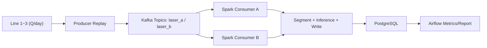
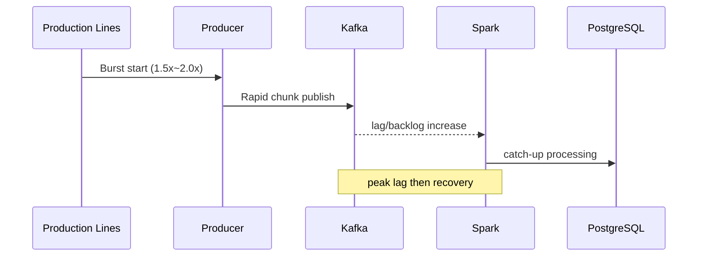
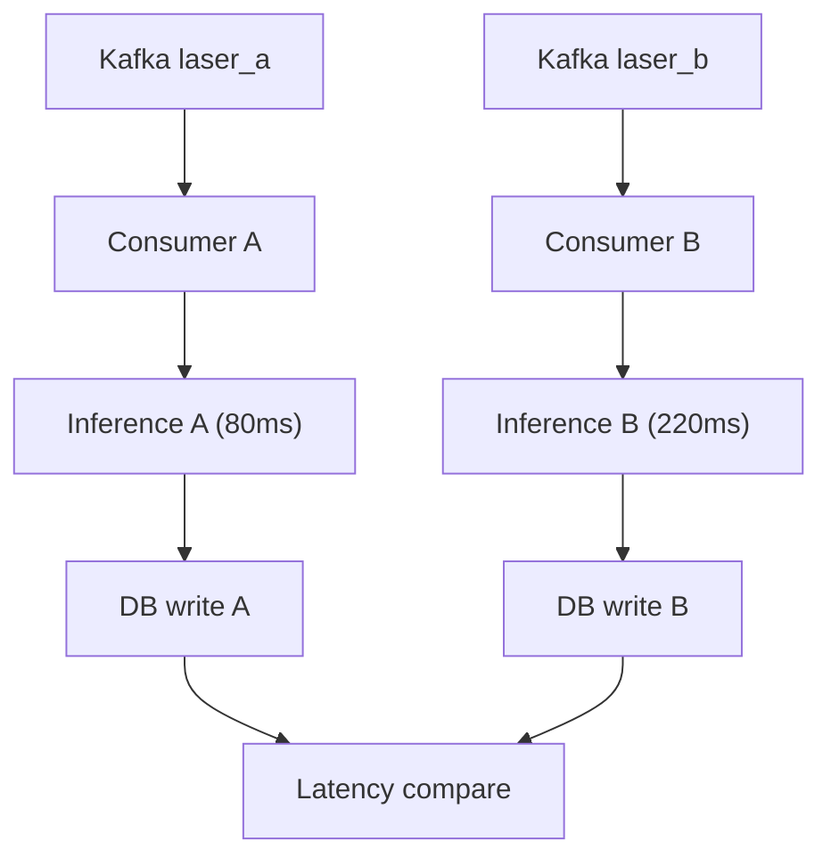
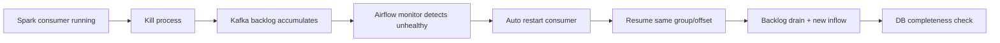

# 6회차 제출 문서: 로드 테스트 및 장애 대응 시나리오 (수정본)

## 0. 문서 목적
- `Kafka -> Spark -> Storage/DB -> Airflow` 파이프라인의 부하 수용력과 장애 복구력을 검증한다.
- 시나리오마다 실행 절차, 측정 항목, 다이어그램, 성공 기준을 함께 제시한다.

## 1. 공통 기준

### 1.1 입력 기준 (오늘 할당량)
- `Q = 오늘 총 배터리 할당량`
- 배터리 1개당 `laser_a`, `laser_b` 2채널이 생성되므로 기대 결과 행 수는 `2Q`.
- 생산라인 수가 바뀌어도 총량은 `Q`로 고정한다.

### 1.2 로컬 환경 제약 (실측)
- CPU: Intel Core Ultra 7 155H (16 cores / 22 logical)
- RAM: 31.53 GB
- OS: Windows 11 Home 64-bit
- Disk(C:): Free 6.79 GB / Total 453.67 GB
- 관찰 병목: Spark worker CPU/메모리 사용 급등, Airflow triggerer 고부하 구간 존재

### 1.3 트래픽 계량 방법
- `Q`, `L`(라인 수), `C`(컨슈머 수) 고정 후 replay speed만 조절해 평시/피크/버스트를 만든다.
- 시나리오별 기본 speed:
  - Baseline: 120
  - Peak: 220
  - Burst: 320
- 측정 지표:
  - `producer_duration_sec`
  - `time_to_first_db_sec`
  - `end_to_last_db_sec`
  - `db_drain_after_producer_sec`
  - `db_rows / expected_rows`
  - consumer lag

### 1.4 실행 도구
- 부하 실행: `scripts/session6_run_load_tests.sh`
- 장애 실행: `scripts/session6_run_failure_tests.sh`
- 저수준 측정: `scripts/measure_p1_c1_stream_timing.sh`

---

## 2. 시나리오 A: 정상 부하(기준선)

### 2.1 목표
- 로컬 환경 기준 안정 처리 가능 구간을 먼저 확보한다.
- 이후 피크/장애 시나리오 비교 기준선으로 사용한다.

### 2.2 입력
- `Q`개 배터리, `L=3`, `C=2(채널 분리)`
- 데이터: `20220417`

### 2.3 다이어그램


### 2.4 성공 기준
- `db_rows >= 0.99 * expected_rows`
- 치명적 실패 없이 run 완료
- 기준선 E2E 지연 확보

---

## 3. 시나리오 B: 피크/버스트 부하

### 3.1 목표
- 순간 이벤트 집중 시 lag 상승폭과 회복 시간을 측정한다.
- 유실 없이 backlog를 소진하는지 확인한다.

### 3.2 현실적인 버스트 원인
- 라인 재가동 후 누적 데이터 일괄 송신
- 네트워크 복구 후 지연분 재전송
- 교대 직후 생산 집중 구간

### 3.3 다이어그램


### 3.4 성공 기준
- 최종 `db_rows == expected_rows` 또는 허용 오차 내
- lag가 임계 시간 내 회복
- 시스템 다운 없이 처리 지속

---

## 4. 시나리오 C: 채널별 추론시간 차이 반영

### 4.1 목표
- `laser_a`, `laser_b` 모델의 추론 시간 차이가 전체 처리지연에 미치는 영향을 계량화한다.
- 현재 판정이 모두 정상(PASS)이어도 추론 시간은 반드시 반영한다.

### 4.2 가정
- 결과값은 정상으로 고정
- 채널별 지연 반영 예시:
  - `laser_a = 80ms`
  - `laser_b = 220ms`

### 4.3 다이어그램


### 4.4 성공 기준
- 채널별 ingest->DB 지연 차이가 재현됨
- 느린 채널이 전체 누락으로 이어지지 않음

---

## 5. 시나리오 D: Spark consumer 중단 후 자동 복구

### 5.1 목표
- Spark consumer 프로세스 강제 종료 시 Airflow monitor DAG가 감지/복구하는지 검증한다.
- 장애 중 누적된 backlog와 신규 유입이 모두 복구 처리되는지 확인한다.

### 5.2 다이어그램


### 5.3 성공 기준
- 감지(MTTD)와 복구(MTTR) 시간이 목표 내
- 복구 후 채널별 expected consumer 수 회복
- 최종 completeness 충족, 중복/누락 허용치 내

---

## 6. 컴포넌트별 장애 대응 전략

| Component | Failure | Detect | Auto Recovery | Manual Intervention Trigger |
|---|---|---|---|---|
| Kafka | lag 급증 | consumer-group lag | consumer 재기동, 처리량 조정 | lag 미회복 지속 |
| Kafka | broker 다운 | produce 실패/metadata 오류 | broker 재기동 후 retry | 재기동 반복 실패 |
| Spark | consumer 중단 | Airflow consumer monitor | DAG 기반 재기동 | 재기동 후에도 멤버 수 미달 |
| Spark | OOM/지연 | lag 상승, batch 지연 | cores/memory 조정, consumer 축소 | 반복 OOM/지속 지연 |
| Airflow | DAG 실패 | UI/task state | retry/backoff | retry 소진 |
| Airflow | SLA 미달 | E2E 지표 초과 | 알림 + 우선순위 조정 | 반복 SLA 위반 |
| PostgreSQL | write 실패 | row 증가 정체/오류 | 연결 재시도 | 장시간 미복구 시 fallback 후 수동 |

---

## 7. 모니터링/알림 기준

### 7.1 도구
- 로컬 실험: Docker stats + Airflow UI + Kafka CLI + PostgreSQL query
- 확장(EC2): Prometheus + Grafana (+ Kafka/JMX exporter)

### 7.2 알림 기준
- Kafka lag 임계치 초과
- 채널별 consumer 수 미달
- Airflow DAG 실패/재시도 소진
- E2E 지연 임계 초과
- DB write 실패/정체

### 7.3 자동복구 vs 수동개입 기준
- 기준은 **컴포넌트 + 시간 축**을 함께 사용
- `T0` 감지 -> `T0+t1` 자동 복구 시도 -> `T0+t2` 미복구 시 수동 전환

---

## 8. 실행 명령

### 8.1 부하 시나리오
```bash
bash scripts/session6_run_load_tests.sh \
  --q 120 \
  --line-count 3 \
  --consumer-count 2 \
  --date-folder 20220417 \
  --host-data-dir /mnt/d/metacode_battery_drfit/data_runtime_flat
```

### 8.2 장애 시나리오
```bash
bash scripts/session6_run_failure_tests.sh \
  --expected-consumers 2 \
  --recovery-timeout-sec 300
```

---

## 9. 결과 기록 템플릿

| Scenario | Input(Q/L/C) | Producer(s) | First DB(s) | Last DB(s) | Lag Peak | Completeness | Result |
|---|---|---:|---:|---:|---:|---:|---|
| A Baseline |  |  |  |  |  |  |  |
| B Peak |  |  |  |  |  |  |  |
| B Burst |  |  |  |  |  |  |  |
| C Inference Gap |  |  |  |  |  |  |  |
| D Failure Recovery |  |  |  |  |  |  |  |
