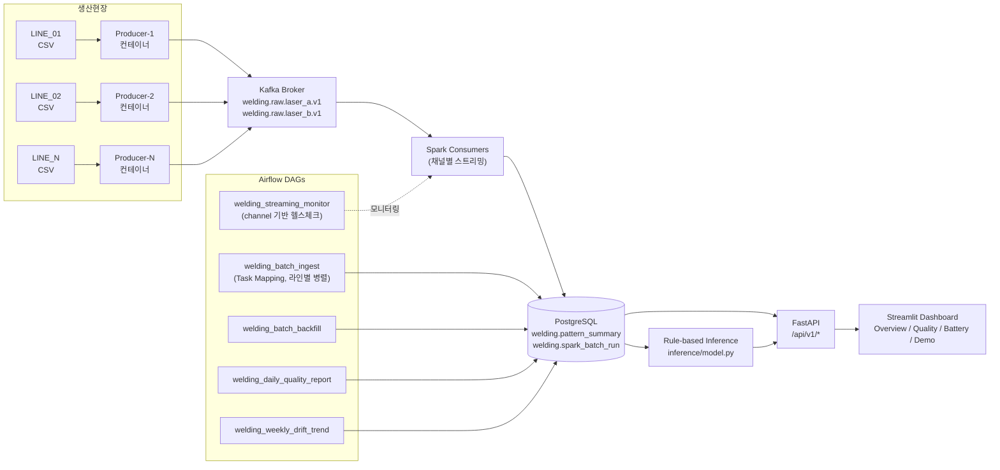

# 용접 드리프트 탐지 파이프라인 — 7차시 업데이트 (2026-05-04)

> 이 문서는 `welding_drift_pipeline_updated.excalidraw`의 텍스트 기반 보완 설명입니다.
> 구성도 변경 이력과 각 차시별 개선 내용을 담고 있습니다.

---

## 최종 아키텍처 (7차시 기준)



---

## 설계 불변식 (7차시 확정)

| 불변식 | 설명 |
|---|---|
| `producer_count == line_count` | 생산라인 1대 = 프로듀서 컨테이너 1개. DAG Task Mapping으로 구현 |
| `quality_decision ∈ {normal, drift}` | 배치·스트리밍 모두 동일한 값 체계 사용 (PASS 폐기) |
| `channel ∈ {0, 1}` | 0=laser_b, 1=laser_a. DB 컬럼 기준으로 모든 헬스체크 통일 |

---

## 차시별 파이프라인 개선 이력

### 1~4차시 — 기초 파이프라인 구축

- Kafka 토픽 설계 (`welding.raw.v1`, `laser_a.v1`, `laser_b.v1`)
- Producer: CSV 파일 → Kafka 청크 발행
- Spark Streaming: 청크 재조립 → pattern_summary 적재
- PostgreSQL 스키마: `pattern_summary`, `spark_batch_run`

### 5~6차시 — Airflow DAG 구축 및 시나리오 검증

- 9개 DAG 구현 (배치 수집, 백필, 모니터링, 리포트, 정리)
- 정상/버스트/모델지연/장애복구 시나리오 실험
- `run_id` 기반 배치-요약 연결 구조 확립

### 7차시 — 품질 판정 체계 전환 및 논리 결함 수정

#### 핵심 아키텍처 수정: 1 Line = 1 Producer (병렬화)

**이전 (결함)**: `welding_batch_ingest` DAG가 단일 BashOperator로 `welding-producer` 컨테이너 1개를 호출하고 `--line-count N`으로 N개 라인 데이터를 **순차 전송**했음.

**수정 후**: Airflow Dynamic Task Mapping으로 라인별 Task를 병렬 생성. `producer.py --line-number {i}`로 각 Task가 독립 실행됨. `producer_count == line_count` 불변식을 DAG 레벨에서 구현.

```
이전: [DAG] → [BashOperator] → [producer(--line-count 3)] → LINE_01, LINE_02, LINE_03 순차
수정: [DAG] → [Task-1(--line-number 1)] ┐
              [Task-2(--line-number 2)] ├→ Kafka (병렬)
              [Task-3(--line-number 3)] ┘
```

#### `quality_decision` 값 체계 전환

| 구분 | 이전 | 7차시 수정 |
|---|---|---|
| 배치 (`spark_batch.py`) | `"PASS"` (하드코딩) | `"normal"` / `"drift"` (cpd_score 기반 판정) |
| 스트리밍 (`spark_streaming.py`) | `"PASS"` | `"normal"` (배치와 통일) |
| drift 추출 필터 | `!= 'PASS'` (정상도 포함) | `== 'drift'` (정확한 필터) |

#### DAG SQL/필터 수정

| DAG | 수정 내용 |
|---|---|
| `welding_streaming_monitor` | `source_file` URI 고정 필터 → `channel` 컬럼 + `processed_at` 시간 기반으로 교체 |
| `welding_daily_quality_report` | 집계 SQL: `PASS/REVIEW/ERROR` → `IN('PASS','normal')` / `'drift'` |
| `welding_batch_ingest` | `validate_results` 필터: `'ERROR'` → `'drift'`, drift_rate 로깅으로 전환 |
| `welding_batch_backfill` | 동일 수정 + `error_rate >= 0.5` 강제 실패 조건 제거 |
| `welding_weekly_drift_trend` | `pass_rate` 계산이 daily_report의 fix와 자동 연동됨 |

#### API / 대시보드 추가

- FastAPI (`api/`): `/health`, `/quality/latest`, `/quality/history`, `/runs/{run_id}`, `/inference/predict`
- Rule-based Inference (`inference/model.py`): cpd_score 기반 임계값 판정, 채널별 지연 반영
- Streamlit Dashboard (`frontend/app.py`): Overview(Total/Normal/Drift), Quality History, Battery Detail, Inference Demo

---

## 수정된 파일 목록 (7차시)

| 파일 | 수정 내용 |
|---|---|
| `spark_batch.py` | quality_decision 판정 로직, drift 추출 필터, line_count DB 저장 |
| `spark_streaming.py` | `"PASS"` → `"normal"` 전환 (3곳) |
| `airflow/dags/welding_batch_ingest.py` | BashOperator → Task Mapping, 'ERROR'→'drift' 필터 |
| `airflow/dags/welding_batch_backfill.py` | 'ERROR'→'drift' 필터, error_rate 강제 실패 제거 |
| `airflow/dags/welding_daily_quality_report.py` | SQL 집계 필터 전환 |
| `airflow/dags/welding_weekly_drift_trend.py` | pass_rate 연동 주석 |
| `airflow/dags/welding_streaming_monitor.py` | source_file → channel 기반 헬스체크 |
| `api/`, `inference/`, `frontend/` | 신규 추가 (7차시) |
